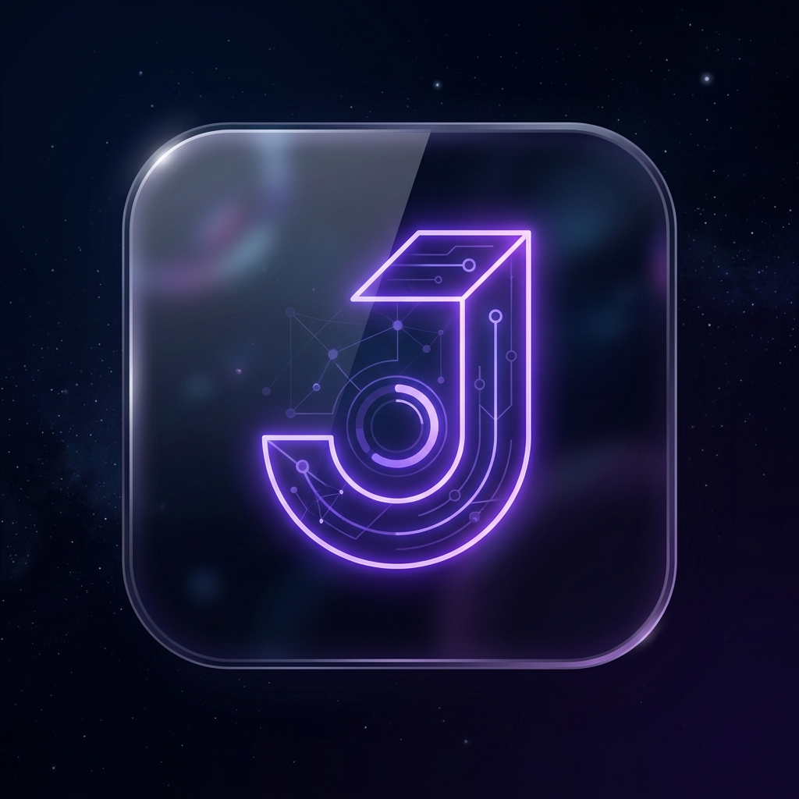

<div align="center">



# ⛩ Junsui 2.0

### *純粋 — Pure, Simple Attendance*

**A modern, mobile-first attendance management system built for Guru Nanak Institute of Technology, Nagpur.**

[](https://react.dev/)
[](https://vite.dev/)
[](https://firebase.google.com/)
[](https://dexie.org/)

---

*Junsui (純粋) means "pure" in Japanese — reflecting the app's philosophy of clean, distraction-free attendance taking.*

</div>

---

## ✨ What's New in 2.0

Junsui 2.0 is a **complete rewrite** from vanilla JavaScript to a modern React architecture. Everything has been rebuilt from scratch for speed, maintainability, and a premium user experience.

| Feature | v1.0 (Legacy) | v2.0 (Current) |
|---------|:---:|:---:|
| **Framework** | Vanilla JS | React 19 + Vite 8 |
| **Routing** | Screen toggling | React Router v7 |
| **Auth** | None | Firebase Auth + PIN-based login |
| **UI** | Basic CSS | Glassmorphism dark theme + Framer Motion |
| **Database** | Dexie v1 | Dexie v3 with complex filtering |
| **UX Gestures** | Buttons only | Tinder-style swipe gestures + Haptics |
| **Exports** | Excel only | Google Sheets Live Sync + PDF + CSV |
| **Timetable** | Manual Entry | Full Auto-detect based on Branch & Time |

---

## 🎯 Features

### 🔐 PIN-Based Authentication
- Sleek numpad interface inspired by iOS lock screen
- 4-digit PIN entry with auto-submit (Default PIN: **2609**)
- Firebase Auth integration (ready for expansion)

### 📋 Smart Session Setup
- **Auto-detect subject** based on day & hour using built-in GNIT timetable
- Smart Lab detection (2-hour slots merged automatically)
- Support for branches: `CSE`, `ETC`, `CSE-DS`, `CSE-CS`
- **Combobox Inputs**: Select from preset subjects or type custom ones

### 📞 Premium Animated Roll Call
- **Tinder-Style Swipe Gestures**: Swipe right for Present (Green glow), swipe left for Absent (Red tilt).
- **Haptic Feedback**: Phone vibrates differently for P, A, and Undo.
- **Progress Ring**: Animated top-left circular indicator showing completion percentage.
- **Undo support** — instantly revert the last swipe.
- Real-time roll number display with formatted branch prefix (e.g., `CSE-035`).

### 📅 Dashboard & Timetable
- **Live NOW Banner**: Highlights the currently running lecture.
- **Today's Schedule**: Complete day's schedule generated dynamically.
- **Holiday Detection**: Auto-detects Sundays, 2nd, and 4th Saturdays with custom messages.

### ☁️ Cloud Sync & Monthly View
- **1-Click Google Sheets Sync**: Uses Google Apps Script Web App to instantly push 1-month bulk data to a live, shareable Google Sheet URL.
- **Excel/CSV Export**: Fallback manual download.
- **Monthly Grid View**: Scrollable Excel-style data grid with sticky headers and percentage calculations.

### 🧪 Demo / Testing Mode
- 1-click **Try Demo Mode** from the dashboard.
- Initializes a fake session with dummy names (Babu Rao, Raju, Shyam, etc.).
- Perfect for demonstrating the app without polluting real IndexedDB storage or Google Sheets.

---

## 🛠 Tech Stack

```
Frontend        React 19 + JSX
Build Tool      Vite 8
Routing         React Router DOM v7
Animations      Framer Motion
Icons           Lucide React
Styling         Vanilla CSS (Glassmorphism dark theme, Outfit font)
Auth            Firebase Authentication
Database        Dexie.js (IndexedDB wrapper)
Cloud Sync      Google Apps Script (Web App POST Webhook)
```

---

## 📁 Project Structure

```
Junsui/
├── index.html                 # Entry point
├── package.json               # Dependencies & scripts
├── vercel.json                # Vercel SPA Routing config
│
├── public/
│   └── logo.png               # Premium App Branding
│
└── src/
    ├── main.jsx               # React DOM root
    ├── App.jsx                # Router + protected routes
    │
    ├── contexts/
    │   └── AuthContext.jsx    # Firebase auth state management
    │
    ├── pages/
    │   ├── Login.jsx          # PIN numpad login screen
    │   ├── Dashboard.jsx      # Home + Today's Schedule + Demo
    │   ├── Setup.jsx          # Configure branch, subject, time
    │   ├── Call.jsx           # Animated roll call (Swipes)
    │   ├── Report.jsx         # Session summary
    │   ├── MonthlyTable.jsx   # 1-Month grid + Live Sheets Sync
    │   └── History.jsx        # Browse past attendance sessions
    │
    ├── db/
    │   ├── db.js              # Dexie database schema
    │   ├── students.js        # Student name data
    │   └── timetable.js       # GNIT Weekly Schedule logic
    │
    └── styles/
        └── global.css         # Design system & Animations
```

---

## 🚀 Getting Started

### Prerequisites
- **Node.js** 18+ and **npm** 9+

### Installation
```bash
git clone https://github.com/swajal41-sudo/Junsui-2.0.git
cd Junsui-2.0
npm install
npm run dev
```

### Environment Setup (`.env`)
To use the Google Sheets Live Sync, create a `.env` file based on `.env.example`:
```
VITE_APP_PIN=2609
VITE_GOOGLE_SHEET_WEB_APP_URL="https://script.google.com/macros/s/..."
```

---

## 🔮 Roadmap

- [x] 📅 **Timetable Integration** — Full weekly schedule, auto-fill session setup, dashboard viewer
- [x] ☁️ **Google Sheets Live Sync** — 1-click cloud sync via Apps Script
- [x] 📱 **Premium Swipe Gestures** — Tinder-style UI for marking attendance
- [ ] PWA support with offline-first caching (manifest.json)
- [ ] Cumulative attendance analytics & defaulter alerts
- [ ] Dark/Light theme toggle
- [ ] Bulk import students from Excel

---

## 🤝 Contributing

Contributions are welcome! Feel free to open issues or submit pull requests.

---

## 👤 Author

**Swajal Indorkar**
- GitHub: [@swajal41-sudo](https://github.com/swajal41-sudo)

---

<div align="center">

**⛩ Built with ❤️ for GNIT Nagpur**

*Junsui 2.0 — Pure Attendance, Simplified.*

</div>
